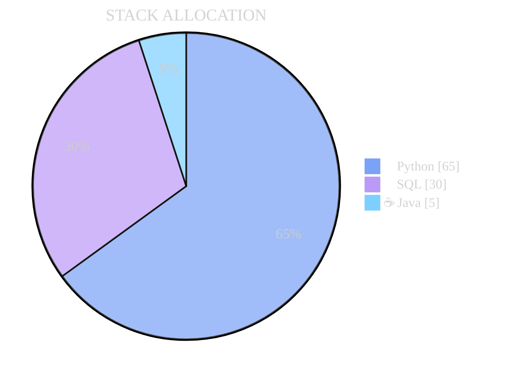

  

  

  

  
  

  

  
  
  
  
  
  
  
  
  
  
  
  
  
  
  

---

# 👋 Hi, I’m SEPURI-SAI-KRISHNA

**Data Engineer** | Spark • Flink • Airflow • AWS • Streaming • AI Orchestration

I design and operate **reliable, scalable batch and real-time data platforms** with a strong focus on:

* correctness
* performance
* failure handling
* automation

> I enjoy turning complex distributed systems into **predictable, operable platforms**.

---

## 🧠 What I Build

* Large-scale **batch & streaming pipelines**
* **Retry-safe, idempotent** data workflows
* **Low-latency analytics** systems
* **AI-driven orchestration** using metadata & MCP
* Cloud-native data platforms on **AWS**

---

## ⚙️ Core Technology Stack

**Languages**
`Python` · `SQL` · `Java`

**Data & Streaming**
`Apache Spark` · `Apache Flink` · `Kafka` · `Iceberg`

**Orchestration & Cloud**
`Airflow` · `AWS (S3, EMR, EMR Serverless, Glue, Athena)` · `Docker`

**AI & Agents**
`Model Context Protocol (MCP)` · `AI Agents` · `LLMs`

---

    

  
    

  
  
    

---

    

  
    
    

  

  
  

    
  
  
  
  

    

  

  
  
  
  
  

---

     

  
    

